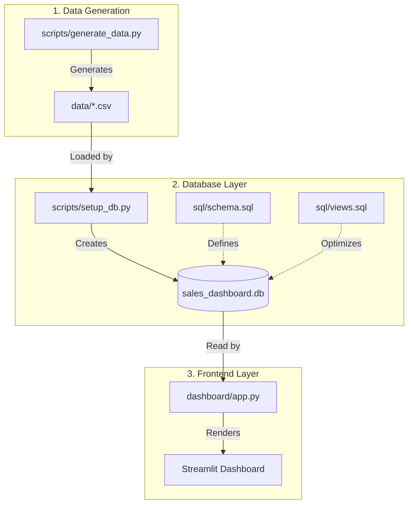

# System Architecture Overview

This document explains how the Sales Performance Dashboard works, from data generation to the frontend visualization.

## Data Flow Diagram

## Component Breakdown

### 1. Data Generation (`scripts/generate_data.py`)
- **What it does**: Simulates a real business environment.
- **Output**: Creates `Product.csv`, `Inventory.csv`, and `Sales.csv` with realistic random data (dates, prices, regions).

### 2. Database Setup (`scripts/setup_db.py`)
- **What it does**: Acts as the ETL (Extract, Transform, Load) pipeline.
- **Process**:
    1.  Initializes a SQLite database (`sales_dashboard.db`).
    2.  Executes `sql/schema.sql` to define table structures.
    3.  Loads the raw CSV data into these tables.
    4.  Executes `sql/views.sql` to create pre-calculated views (e.g., `vw_sales_summary`) for faster querying.

### 3. Analysis & Visualization
- **Backend Analysis (`scripts/run_analysis.py`)**: Runs complex SQL queries from `sql/queries.sql` to calculate metrics like "Monthly Revenue Growth" and prints them to the console.
- **Frontend Dashboard (`dashboard/app.py`)**:
    -   Connects directly to `sales_dashboard.db`.
    -   Uses **Pandas** to fetch data.
    -   Uses **Plotly** to render interactive charts.
    -   Uses **Streamlit** to display the UI and handle user filters (Date, Region).

## How to Update Data
To refresh the dashboard with new data:
1.  Run `python scripts/generate_data.py` (creates new random data).
2.  Run `python scripts/setup_db.py` (rebuilds the database).
3.  Refresh the Streamlit browser tab.
